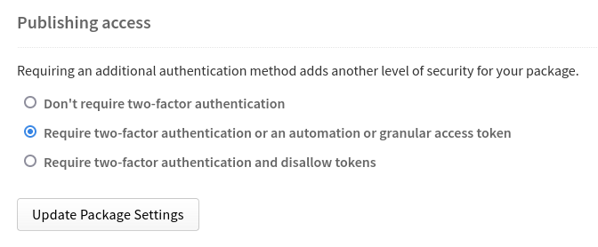

This week, at long last, GitHub [announced granular access tokens for npm](https://github.blog/changelog/2023-03-21-general-availability-of-granular-access-token-on-npm/). This is a big deal! It's great for security generally, but also particularly useful if you maintain any npm packages, as it removes the main downside of automating npm publishing, by allowing you to give CI jobs only a very limited token instead of full 2FA-free access to your account.

In the past, I've wished for this, because I maintain [a fair few npm packages](https://www.npmjs.com/~pimterry) including some [very widely used ones](https://www.npmjs.com/package/loglevel). The previous solution of "just disable 2FA on your account, create an all-powerful access token with global access to every package, and give that token to your CI job" was not a comfortable one.

Regardless of your situation, isolating any risk of issues in security-sensitive situations like this is a good move, and ensures that any leak of (or legitimate access to) your CI secrets for one project doesn't imply a complete takeover of everything on your npm account.

As soon as I saw this was now available, I jumped on automating npm publishing for a few of the packages that I've been manually publishing until now. The process is pretty quick and easy, let's walk through the steps:

1. Get an access token for your package
    * Log into [npmjs.com](https://www.npmjs.com/login)
    * Click your profile picture in the top right, then 'Access Tokens', 'Generate New Token', and 'Granular Access token' (or jump to `npmjs.com/settings/$YOUR_USERNAME/tokens/granular-access-tokens/new`)
    * Set a useful name, a long expiry (up to you), 'Read and write' permissions, and pick the specific package that you're publishing
2. Add your token as a secret for your project's GitHub Actions
    * Jump to `https://github.com/$YOU/$REPO/settings/secrets/actions/new`
    * Set `NPM_PUBLISH_TOKEN` as the secret name
    * Copy the `npm_...` token from the previous step as the secret value
3. In your npm package's settings (i.e. `https://www.npmjs.com/package/$PACKAGE_NAME/access`), allow publish without 2FA for granular/automation tokens only, so that tokens can be used for publishing:
    
3. Add a publish step to your GitHub actions script.
    * The specific details of this will depend on your current setup - you might want to do this on tagged releases, automatically on a schedule, or with a manually triggered job.
    * In my case, I'm most interested in automatically publishing [openapi-directory-js](https://github.com/httptoolkit/openapi-directory-js/), and I've set this all up initially with a workflow I can manually trigger - the full script is [here](https://github.com/httptoolkit/openapi-directory-js/commit/566e8a6688126628efd6b706ed2020bfcdeae372).
    * Regardless of how you manage the trigger, the key parts you'll need for the publish itself are these:
        ```yaml
        # When setting up node:
        - uses: actions/setup-node@v3
          with:
            node-version: '16.x'
            registry-url: 'https://registry.npmjs.org' # <-- the registry-url here is required

        # ...[build & test etc]...

        # Bump the version & push (if you're not doing that elsewhere)
        - name: Bump version & push
          run: |
            git config --global user.name 'Automated publish'
            git config --global user.email '$YOUR_USERNAME@users.noreply.github.com'

            # Update the version in package.json, and commit & tag the change:
            npm version patch # YMMV - you might want the semver level as a workflow input

            git push && git push --tags

        # Publish the result to npm with your granular token:
        - run: npm publish
          env:
            NODE_AUTH_TOKEN: ${{ secrets.NPM_PUBLISH_TOKEN }}
        ```

That's it! Once this is in place, your job will automatically bump the version of your package, then commit, tag & push that bump, and then publish the result to npm. All without needing to disable 2FA for your package for normal usage, or add any globally all-powerful npm tokens anywhere.

Hope that helps out others in the same space. If you have feedback or questions, let me know [on Mastodon](https://toot.cafe/@pimterry), [on Twitter](https://twitter.com/pimterry), or [send a message directly](/contact/).

_Want to debug, test or mock HTTP(S), from Node.js, browsers, servers, phones, and everything else? Try out **[HTTP Toolkit](https://httptoolkit.com/javascript/)** now._